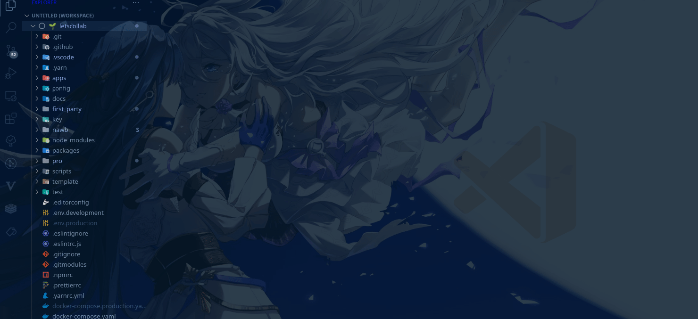
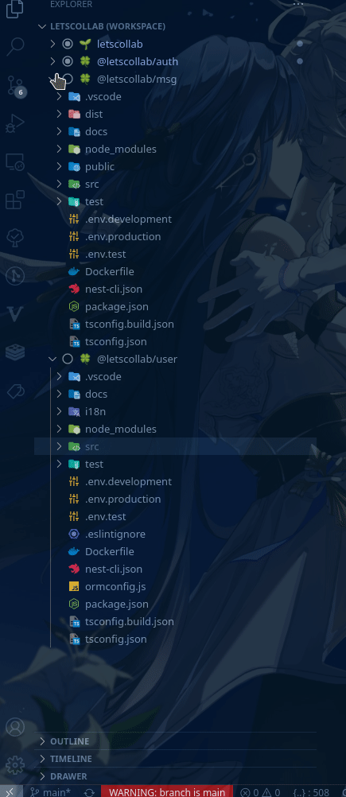
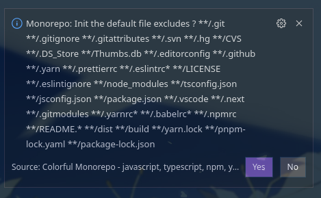

[中文](https://github.com/deskbtm/colorful-monorepo/blob/main/README-zh.md)

<sup>Doc partially translated by deepl</sup>

# Colorful Monorepo

 <a href="https://github.com/deskbtm/colorful-monorepo/issues">
      
</a>

## Usage

### Workspace

Support `npm`,`yarn`, `pnpm`, `lerna`, `rush`.

You can also add the folder manually that not includes `package.json` by `Monorepo: As Workspace`.

### Drawer

Drawer ensures a crisp presentation of the workbench in the case of multiple Workspaces or with a large number of configurations, allowing you to focus more on the development of business code.

You can add files to the Drawer with `Monorepo: Move to drawer(Glob)`, which supports multiple selections. Note that the added file will take effect on all files of the same name in the project.



**For performance reasons, all folders are displayed in the drawer**

`ctrl+p` + `Monorepo: preset` to set default exclude.



You can click the `Edit Workspace File` button in DrawerView to fix errors.

### Colorize

Colorful Monorepo categorizes the files in each Workspace and displays them in a different color in the status bar at the bottom.

### Configuration

```json
"ColorfulMonorepo.workspaces.prefix.root": {
  "type": "string",
  "default": "🌱 ",
  "description": "Folder prefix for the root folder"
},
"ColorfulMonorepo.workspaces.custom": {
  "type": "array",
  "default": [],
  "description": "Custom workspace prefix icon e.g [{regex:'foo', prefix:'🥳 '}, {regex:'bar', prefix:' 🖖🏻'}]"
},
"ColorfulMonorepo.colorize.enabled": {
  "type": "boolean",
  "default": true,
  "description": "The files dose not change frequently will move to Drawer"
},
// Experiment
"ColorfulMonorepo.arrange.enabled": {
  "type": "boolean",
  "default": false,
  "description": "Enable auto arrange the editor by workspace"
},
"ColorfulMonorepo.drawer.exclude": {
  "type": "object",
  "default": {
    "**/.git": true,
    "**/.gitignore": true,
    "**/.gitattributes": true,
    "**/.svn": true,
    "**/.hg": true,
    "**/CVS": true,
    "**/.DS_Store": true,
    "**/Thumbs.db": true,
    "**/.editorconfig": true,
    "**/.github": true,
    "**/.yarn": true,
    "**/.prettierrc": true,
    "**/.eslintrc*": true,
    "**/LICENSE": true,
    "**/.eslintignore": true,
    "**/node_modules": true,
    "**/tsconfig.json": true,
    "**/jsconfig.json": true,
    "**/package.json": true,
    "**/.vscode": true,
    "**/.next": true,
    "**/.gitmodules": true,
    "**/.yarnrc*": true,
    "**/.babelrc*": true,
    "**/.npmrc": true,
    "**/README.*": true,
    "**/dist": true,
    "**/build": true,
    "**/yarn.lock": true,
    "**/pnpm-lock.yaml": true,
    "**/package-lock.json": true
  },
  "description": "Default exclude files"
}

```

To improve the performance, the drawer will show all directories, even if it is not in `files.exclude`.

## License

Colorful Monorepo is available under the [AGPL license](https://github.com/deskbtm/colorful-monorepo/blob/main/LICENSE).

## Credits

https://github.com/microsoft/workspace-tools MIT license

## What's Next

Auto arrange.

## Pricing

If you have a wonderful experience, don't forgot to buy me a coffee.

## My other extensions

[android-adb-wlan](https://marketplace.visualstudio.com/items?itemName=HanWang.android-adb-wlan)

**Enjoy !** 🖖

<div>
<a href="https://www.buymeacoffee.com/Nawbc">
  
</a>

</div>
